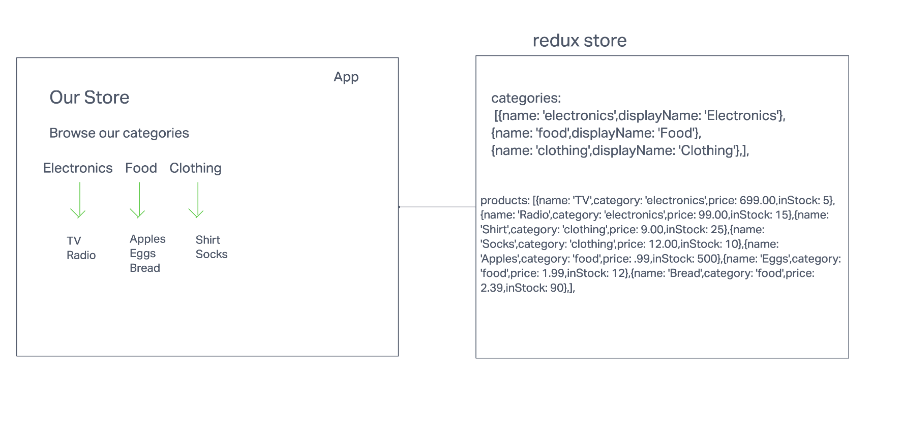

Application State with Redux

#### storefront application

This is a simple storefront application that uses Redux to manage the state of the application. 

The following user/developer stories detail the major functionality for this phase of the project.

As a user, I expect to see a list of available product categories in the store so that I can easily browse products.

As a user, I want to choose a category and see a list of all available products matching that category.

As a user, I want a clean, easy to use user interface so that I can shop the online store with confidence.

#### Application ArchitectureCategories
State should contain a list of categories as well as the active category.
Each category should have a normalized name, display name, and a description.
Create an action that will trigger the reducer to change the active category.
Update the active category in the reducer when this action is dispatched.
Products
State should be a list of all products.
Each product should have a category association, name, description, price, inventory count.
Create an action that will trigger when the active category is changed.
HINT: Multiple reducers can respond to the same actions.
Create a reducer that will filter the products list based on the active category.
Active Category
State should store active category.
Other components (products, etc) might need to reference this.

#### Testing
Create unit tests for all of the reducers and actions.

